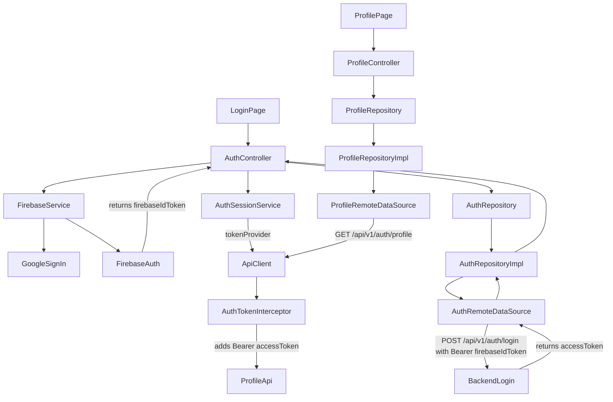

# Network Flow

## Architecture Overview

This app follows a layered network architecture for auth and profile:

1. **Presentation layer** (`Controller` / `Page`) starts actions and renders UI state.
2. **Domain layer** (`Repository interface`) defines behavior contracts.
3. **Data layer** (`Repository impl` + `RemoteDataSource`) performs real API calls.
4. **Core network layer** (`ApiClient`, interceptors, endpoints, env config) provides shared HTTP setup.
5. **Session layer** (`AuthSessionService`) stores backend `accessToken` for subsequent API calls.

`firebaseIdToken` and backend `accessToken` are intentionally separate:
- `firebaseIdToken`: generated by Firebase after Google sign-in; sent once to `/api/v1/auth/login`.
- `accessToken`: returned by backend; used in `Authorization: Bearer <accessToken>` for protected APIs like profile.

## End-to-End Flow Diagram

## Runtime Flow (Step by Step)

### 1) Google sign-in flow
- `LoginPage` triggers `AuthController.signInWithGoogle()`.
- `AuthController` calls `FirebaseService.signInWithGoogle()`.
- `FirebaseService` runs Google sign-in and Firebase credential sign-in.
- On success, `AuthController` fetches `firebaseIdToken` using `FirebaseService.getIdToken(forceRefresh: true)`.

### 2) Login API flow
- `AuthController` calls `AuthRepository.loginWithFirebaseToken(firebaseIdToken)`.
- `AuthRepositoryImpl` forwards to `AuthRemoteDataSource`.
- `AuthRemoteDataSource` calls `POST /api/v1/auth/login` with:
  - `Authorization: Bearer <firebaseIdToken>`
- API response is validated and backend `accessToken` is extracted.

### 3) Access token persistence flow
- `AuthController` stores backend token with `AuthSessionService.setAccessToken(accessToken)`.
- `ApiClient` is configured with `tokenProvider: AuthSessionService.getAccessToken`.
- `AuthTokenInterceptor` reads this token on every request and injects:
  - `Authorization: Bearer <accessToken>`

### 4) Profile API flow
- Opening `ProfilePage` initializes `ProfileController`.
- `ProfileController.onInit()` calls `loadProfile()`.
- `ProfileRepository -> ProfileRepositoryImpl -> ProfileRemoteDataSource` performs `GET /api/v1/auth/profile`.
- `AuthTokenInterceptor` automatically attaches backend bearer token.
- UI updates with loading/success/error states in `ProfilePage`.

### 5) Logout cleanup flow
- `AuthController.signOut()` clears `AuthSessionService` token.
- Then Firebase sign-out is executed.
- This prevents old tokens from being used in future API calls.

## File-by-File Responsibilities

- [lib/config/bindings/initial_binding.dart](C:/Users/Admin-LFI/develop/Satya_devotte_app/lib/config/bindings/initial_binding.dart)  
  Registers all DI dependencies (FirebaseService, AuthSessionService, ApiClient, repositories, controllers).

- [lib/config/env/app_env.dart](C:/Users/Admin-LFI/develop/Satya_devotte_app/lib/config/env/app_env.dart)  
  Resolves environment and base URL (`resolvedApiBaseUrl`) with support for env override.

- [lib/core/network/api_client.dart](C:/Users/Admin-LFI/develop/Satya_devotte_app/lib/core/network/api_client.dart)  
  Creates shared `Dio` client with base options, timeouts, and network interceptors.

- [lib/core/network/interceptors.dart](C:/Users/Admin-LFI/develop/Satya_devotte_app/lib/core/network/interceptors.dart)  
  `AuthTokenInterceptor` injects bearer token from token provider; `ApiErrorInterceptor` centralizes error pass-through.

- [lib/core/network/api_endpoints.dart](C:/Users/Admin-LFI/develop/Satya_devotte_app/lib/core/network/api_endpoints.dart)  
  Holds endpoint constants (`/api/v1/auth/login`, `/api/v1/auth/profile`).

- [lib/core/services/firebase_service.dart](C:/Users/Admin-LFI/develop/Satya_devotte_app/lib/core/services/firebase_service.dart)  
  Owns Firebase/Google auth integration, Firebase ID token retrieval, and Firebase logout.

- [lib/core/services/auth_session_service.dart](C:/Users/Admin-LFI/develop/Satya_devotte_app/lib/core/services/auth_session_service.dart)  
  In-memory storage for backend `accessToken` used by API interceptor.

- [lib/features/auth/data/datasources/auth_remote_data_source.dart](C:/Users/Admin-LFI/develop/Satya_devotte_app/lib/features/auth/data/datasources/auth_remote_data_source.dart)  
  Executes login API call using Firebase token and extracts backend `accessToken`.

- [lib/features/auth/data/repositories/auth_repository_impl.dart](C:/Users/Admin-LFI/develop/Satya_devotte_app/lib/features/auth/data/repositories/auth_repository_impl.dart)  
  Concrete implementation that delegates auth login to remote datasource.

- [lib/features/auth/domain/repositories/auth_repository.dart](C:/Users/Admin-LFI/develop/Satya_devotte_app/lib/features/auth/domain/repositories/auth_repository.dart)  
  Auth contract used by presentation layer (`loginWithFirebaseToken`).

- [lib/features/auth/presentation/controllers/auth_controller.dart](C:/Users/Admin-LFI/develop/Satya_devotte_app/lib/features/auth/presentation/controllers/auth_controller.dart)  
  Orchestrates sign-in lifecycle: Firebase sign-in -> login API -> store access token -> UI state/error handling.

- [lib/features/profile/data/datasources/profile_remote_data_source.dart](C:/Users/Admin-LFI/develop/Satya_devotte_app/lib/features/profile/data/datasources/profile_remote_data_source.dart)  
  Calls profile endpoint via `ApiClient`.

- [lib/features/profile/data/repositories/profile_repository_impl.dart](C:/Users/Admin-LFI/develop/Satya_devotte_app/lib/features/profile/data/repositories/profile_repository_impl.dart)  
  Concrete profile repository that delegates to remote datasource.

- [lib/features/profile/domain/repositories/profile_repository.dart](C:/Users/Admin-LFI/develop/Satya_devotte_app/lib/features/profile/domain/repositories/profile_repository.dart)  
  Profile contract (`getProfile`) for presentation usage.

- [lib/features/profile/presentation/controllers/profile_controller.dart](C:/Users/Admin-LFI/develop/Satya_devotte_app/lib/features/profile/presentation/controllers/profile_controller.dart)  
  Loads profile on init, exposes reactive loading/data/error state for UI.

- [lib/features/profile/presentation/pages/profile_page.dart](C:/Users/Admin-LFI/develop/Satya_devotte_app/lib/features/profile/presentation/pages/profile_page.dart)  
  Renders profile UI states and triggers refresh/logout actions.

## Error Handling Behavior

- **Google/Firebase errors** are mapped in `AuthController._mapGoogleSignInError`.
- **Login API errors** from `DioException` are mapped into user-readable messages in `AuthController`.
- **Profile API errors** are mapped in `ProfileController`:
  - `401` -> session expired message
  - others -> generic profile load failure

## Production Notes

- Base URL is controlled by `AppEnv.resolvedApiBaseUrl`.
- `API_BASE_URL` can override runtime target without code change.
- `AuthTokenInterceptor` uses backend `accessToken` from `AuthSessionService`, not Firebase token.
- Protected APIs (example: profile) depend on successful auth login response and token storage.
